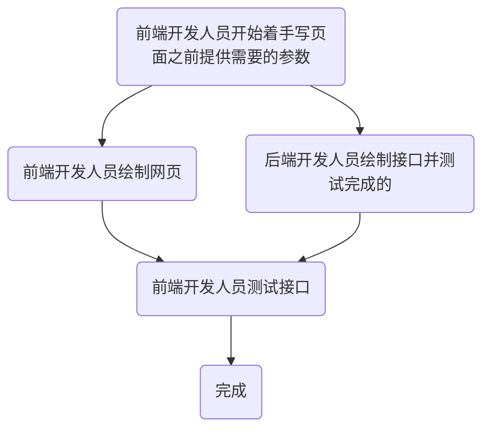

# jspproject

## 工作计划

### 工作流程

### 时间流程

| 序号 | 后端工作内容| 前端工作内容 | 时间节点 |
| ---- | -------- | -------- |--------|
| 1    | 完成所有元素基本的增删改查接口 | 设计完成主页,列表页,更新页表单页等所有页面的外部框架,并完成主页 | 6.11之前 |
| 2    | 根据上面的工作流程配合前端开发接口 | 开发每个页面的具体功能 | 6.14之前 |
| 3    | 配合最后的测试 | 最后的测试 | 6.16 |

## 代码规范:

### 数据库操作
#### 删除
   对于连接表与显然的1对1的表才可以采用级联删除

   不允许级联删除实体表

   因为经验不足,部分实体表没有提供enabled
#### 更新
   修改指针:修改父类目标的指向,涵盖在父类的修改内容中,修改的对象必须已经存在在数据库中,否则抛出异常

   修改内容:修改内部内容,本身的字段,但是不得修改子元素的内容
#### 插入
   不允许级联插入,插入的内容必须显式地存在于service层,否则抛出异常

   插入时的内容子元素必须存在,否则抛出异常

   插入实体时需要保证除了id以外,也有其他的元素存在不同,否则返回已有实体的id(封装在Manager层)

   接上,假定了数据库内不存在内容相同的实体
#### 主旨
   通过减少级联的操作,减少数据库的负荷,减少多余的操作,增加系统的性能
#### 约定
   数据的插入与更新可能会改变数据本身的Id值,在逻辑调用的时候需要注意,insert某个对象后对象的id值可能发生变化,需要在调用完后更新id,以保持同步.(也可以直接在方法中改变,可改),update的此项功能也添加完毕

   注意在每次update与insert后关注id值的变化

   连接表的逻辑依附于实体表的操作以减少冗余的逻辑

   一对多,多对多连接表的更新直接使用delete,insert实现
### 工程分层
#### pojo:
   负责存储表数据的实体类
#### Dao:
   驱动数据库,所有sql语句都在这里,只拥有简单的sql逻辑
#### Manager:
   负责封装Dao层的逻辑,使其可以实现业务逻辑

   一个Manager只能对应一个Dao,如果需要调用其他Dao直接调用其他的Manger

   Manager将使用两个接口与一个实现类来实现部分暴露
#### Service:
   具体业务逻辑的实现层,具体的业务逻辑都在这里,Serive根据实施对象分类,调用适合的Manager,进行业务逻辑,尽量减少横向耦合

   脱离的Manager的Service,根据功能分类
#### Controller:
   完全面向页面生成,根据具体页面生成不同controller,调用适合的Service来实现
### 版本控制
#### 推送
  所有成员对工程创建一个远程分支,然后提交到这个远程分支上,不允许直接提交到Master分支,cjj会将pull请求rebase到master上,分支名称用姓名首字母

  在开始写代码之前将master分支与本地代码merge之后再进行编码
